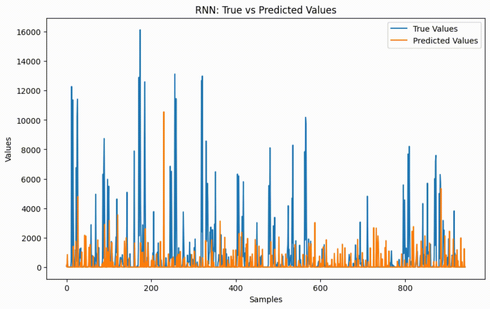
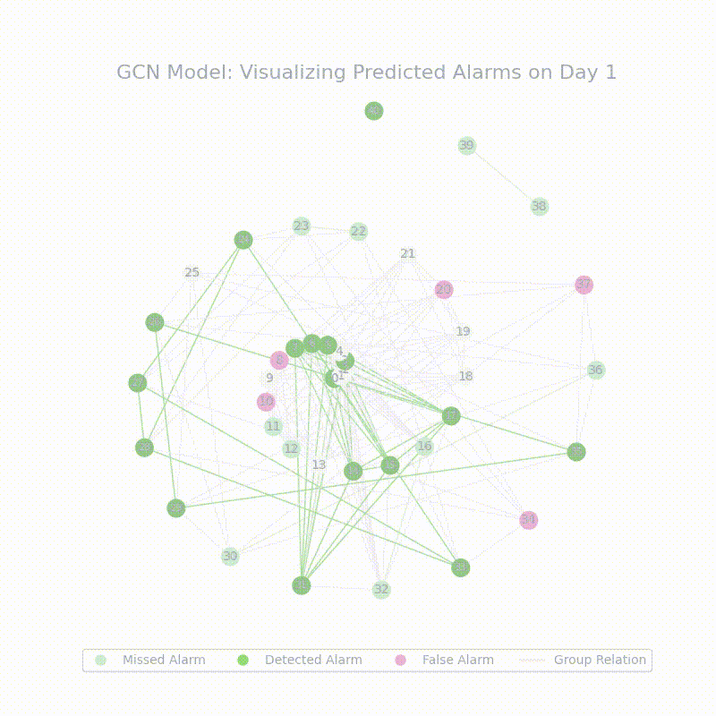
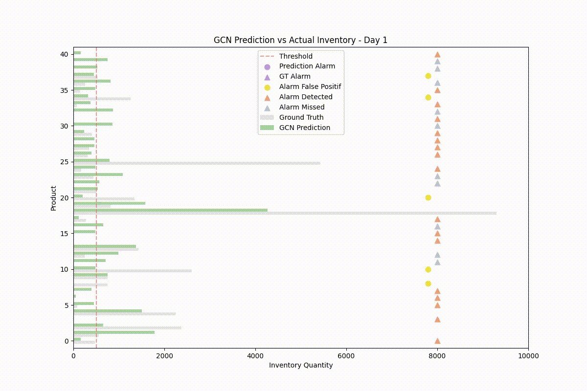
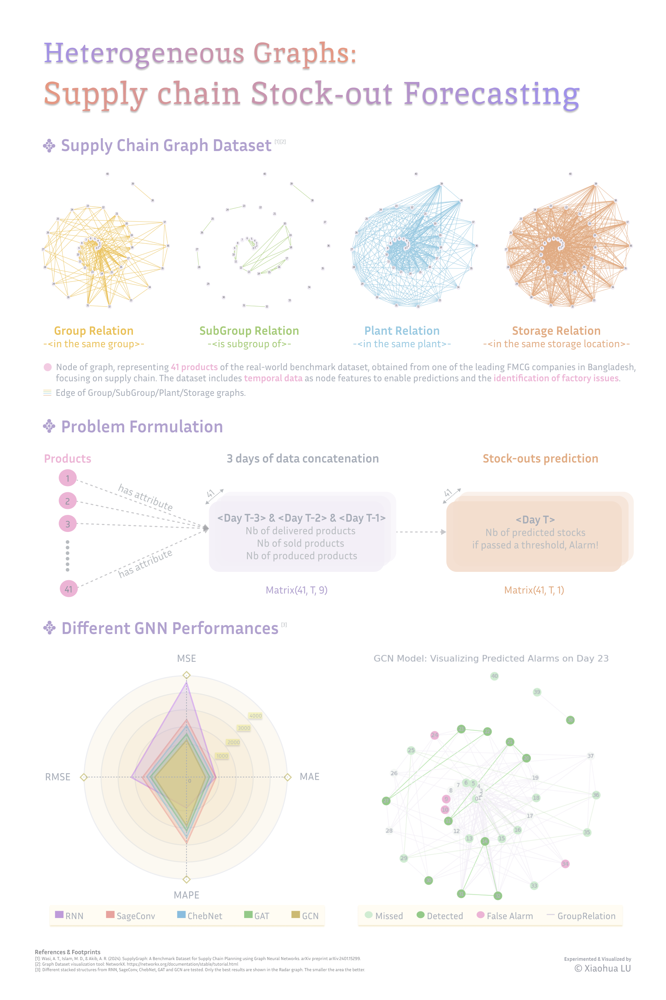

# **Disruption Forecasting in Supply Chain**

This repository contains the code, data and report for my personal project on disruption forecasting in supply chains using Graph Neural Networks (GNNs). The project focuses on studying the performance of various GNN models using dynamic heterogeneous graph datasets and comparing these models with traditional Recurrent Neural Network (RNN) approaches. The goal is to explore the potential of dynamic heterogeneous graphs in addressing terminal issues in supply chains.

## **Project Overview**

Supply chain disruptions can have significant impacts on businesses, leading to delays, increased costs, and reduced customer satisfaction. This project aims to predict such disruptions by leveraging the power of Graph Neural Networks. Specifically, the project explores:
- The performance of different GNN models in predicting supply chain disruptions.
- A comparative analysis between GNN-based models and traditional RNN-based methods.
- The application of dynamic heterogeneous graphs to model and predict supply chain terminal issues.

## **Dataset**

The dataset used in this project is the **SupplyGraph** dataset, which is publicly available and specifically designed for supply chain planning using Graph Neural Networks. The dataset includes various dynamic and heterogeneous graph data relevant to supply chains.

### **Citation**

If you use this dataset, please cite the following work:

```bibtex
@inproceedings{supplymap2023wasi,
      title={SupplyGraph: A Benchmark Dataset for Supply Chain Planning using Graph Neural Networks}, 
      author={Azmine Toushik Wasi and MD Shafikul Islam and Adipto Raihan Akib},
      year={2023},
      booktitle={4th workshop on Graphs and more Complex structures for Learning and Reasoning, 38th Annual AAAI Conference on Artificial Intelligence},
      url={https://github.com/CIOL-SUST/SupplyGraph/},
      doi={10.48550/arXiv.2401.15299}
}
```
For more information, visit the [SupplyGraph GitHub repository](https://github.com/CIOL-SUST/SupplyGraph).

## **Results**

### **Prediction vs. Ground Truth**



This plot shows the comparison between the predicted disruptions and the actual ground truth disruptions of different tested models over time.

### **Alarm Predictions**



This GIF illustrates the best model GCN's results: the model predicted alarms, the actual alarms, and any missed alarms, providing insights into the model's accuracy and group relationships. 
It can be observed that products belonging to the same group have a tendency to be at risk of supply disruption at the same time.

### **Comprehensive Visualization**



This visualization combines prediction results with ground truth and alarm signals, offering a holistic view of the GCN model's performance in real-time.

## **A detailed repport of the project**



## **License**

This project is licensed under the Apache License 2.0. See the [LICENSE](path/to/your/license) file for more details.
